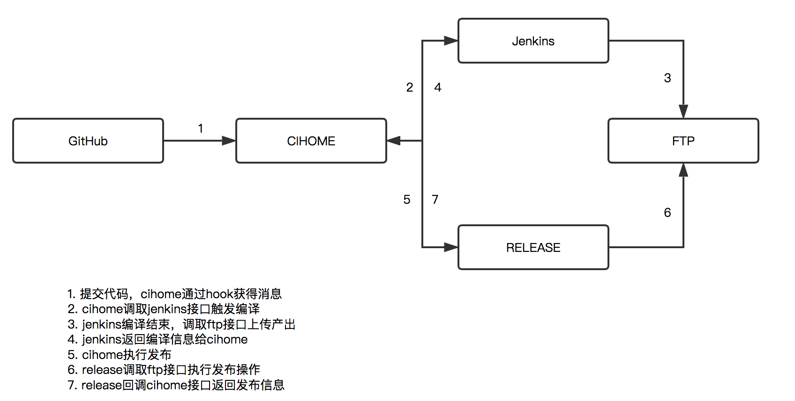

# CIHome

CIHome 是一个面向持续集成与交付场景的一体化平台，围绕代码提交、构建编译、流水线可视化、发布审核与权限管理等环节提供端到端能力。项目侧重于自建交付中枢：以 GitHub Webhook 触发事件，以 Jenkins 编排构建与部署，通过 MQ/FTP 服务完成制品归档，并在统一的可视化门户中展现状态。

## 系统架构概览



- **事件驱动**：GitHub 的 Hook 服务推送提交事件，CIHome 负责解析并持久化，随后推送到 MQ。
- **流水线执行**：Jenkins 插件式任务根据 MQ 消息启动构建，执行编译、测试与制品打包，产物上传至 FTP。
- **数据聚合与展示**：CIHome 后端对接 Jenkins API、MQ 与数据库，生成流水线、发布、权限等业务数据，前端单页应用负责交互展示。

## 技术栈

- **后端**：Spring MVC + Spring + Hibernate，MySQL 作业数据存储，Logback 统一日志；引入 Jenkins Client、Apache HttpClient、MQ 以及 FTP 客户端工具。
- **前端**：AngularJS 1.x、RequireJS、Bootstrap、Font Awesome；构建流程由 Bower + Grunt + npm 负责依赖与打包。
- **运行方式**：Maven 构建为 `war` 包，可通过 Jetty 插件快速启动或部署至任意 Servlet 容器。

## 代码结构

```
src/main/java
├─ com.jlu.cihome           # 门户入口控制器
├─ com.jlu.branch           # 分支信息同步、展示
├─ com.jlu.github           # GitHub Webhook、提交记录、模块管理
├─ com.jlu.jenkins          # Jenkins 任务触发、状态同步
├─ com.jlu.compile          # 构建记录、日志、状态查询
├─ com.jlu.pipeline         # 流水线组装、分支/主干视图
├─ com.jlu.release          # 发布编排、制品下发
├─ com.jlu.user             # 用户、登录、权限
└─ com.jlu.common           # 公共 DAO、异常、工具与拦截器
src/main/resources
├─ cihome.properties        # 平台自定义配置（主机、凭证等）
├─ db_config.properties     # 数据库、连接池配置
├─ logback.xml              # 日志级别与输出
└─ spring/*.xml             # Spring、Spring MVC、服务层装配
src/main/webapp
├─ resources/common         # 公共样式、第三方库
├─ resources/widget         # 自定义组件（加载、提示、常量）
├─ dev                      # AngularJS 应用源码（路由、服务、指令）
└─ WEB-INF                  # JSP 入口、Spring MVC Dispatcher 配置
```

### 关键后端模块

- `com.jlu.github`：负责解析 GitHub Webhook、存储仓库/提交/模块信息，并提供 REST 接口给前端查询。
- `com.jlu.jenkins`：封装 Jenkins Remote API，触发构建、轮询构建状态，并对接 MQ 事件。
- `com.jlu.pipeline`：聚合分支、构建、发布等数据，生成流水线视图的 JSON 数据。
- `com.jlu.release`：定义发布参数、状态机、制品信息，通过 FTP 工具将制品同步到目标库。
- `com.jlu.common`：包含通用 DAO 抽象、条件构造器、拦截器（登录校验、API 签名）以及 Jenkins/GitHub/FTP 等工具。

### 前端结构

- `dev/startup`：Angular 应用入口（`app.js`, `router.js`, `start.js`）。
- `dev/pipeline`：流水线页面的控制器、服务与指令，例如 `pipeline-builds.js`、`pipeline-service.js`。
- `dev/permission`：权限/注册相关控制器与服务。
- `dev/tpl`：HTML 模板集合，覆盖配置、流水线视图、弹窗等。
- `resources/common/lib`：通过 Bower 引入的 Angular、Bootstrap、jQuery、RequireJS 等第三方库。

## 外部依赖与配置

| 组件 | 作用 | 配置位置 |
| --- | --- | --- |
| MySQL | 持久化流水线、构建、权限等数据 | `src/main/resources/db_config.properties` |
| Jenkins | 执行构建/部署任务 | `cihome.properties`（Jenkins 主机、凭证） |
| MQ 服务 | 在 GitHub 事件与 Jenkins 之间解耦 | `cihome.properties` 或环境变量 |
| FTP | 存储构建产物、发布包 | `cihome.properties` 中的 FTP 配置 |

> 建议将敏感凭证放在外部配置或环境变量中，再由 `CiHomeReadConfig` 动态读取。

## 本地开发与构建

1. **环境准备**
   - JDK 1.7+（建议 1.8）、Maven 3.5+、Node.js 14+。
   - MySQL 数据库并导入基础表结构（可根据 `model`/`dao` 定义自建）。
   - Jenkins、MQ、FTP 等外部服务可按需搭建或使用云服务。
2. **后端启动**
   ```bash
   mvn clean package
   mvn jetty:run
   ```
   默认通过 Jetty 在 `http://localhost:8888/` 暴露应用，也可以将 `target/CIHome-1.0-SNAPSHOT.war` 部署到 Tomcat。
3. **前端依赖**
   ```bash
   cd src/main/webapp
   npm install
   bower install
   grunt build   # 可根据 Gruntfile 选择 watch / build
   ```
4. **配置**：根据环境修改 `src/main/resources/*.properties`，并确保 `spring-*.xml` 中的组件扫描路径与数据库配置一致。

## 运行时入口与 API

- Spring MVC 的 Dispatcher Servlet 定义在 `WEB-INF/web.xml`，扫描 `com.jlu.*.web` 包下的控制器。
- REST/JSON 接口主要位于各模块 `web` 包，例如 `GithubDataController`, `CiHomePipelineController`, `ReleaseController` 等。
- 登录与权限由 `LoginInterceptor`、`HttpApiAccessInterceptor` 负责，在 `spring-servlet.xml` 中统一注册。

## 开发约定

- DAO 层统一继承 `AbstractBaseDao` / `IBaseDao`，条件拼装使用 `com.jlu.common.db.sqlcondition`。
- Service 层通过 Spring 事务注解管理，跨模块调用通过接口注入。
- 前端模块化以 RequireJS 按需加载，`startup/router.js` 是路由集中声明位置。
- 日志使用 Logback，配置位于 `logback.xml`，默认输出到控制台与文件，可按环境调整。

## 参考资料

- Jenkins Client: <https://github.com/RisingOak/jenkins-client>
- ActiveMQ 文档: <https://activemq.apache.org/>
- AngularJS 指南: <https://docs.angularjs.org/guide>

欢迎通过 Issue 或 Pull Request 分享使用反馈与改进建议。
